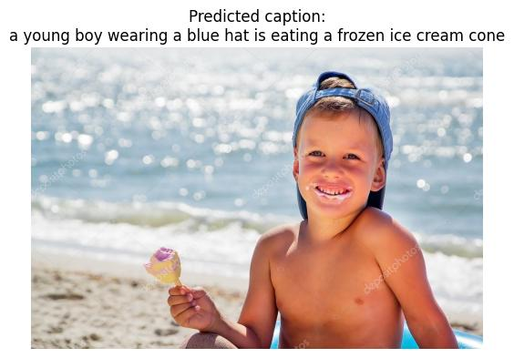
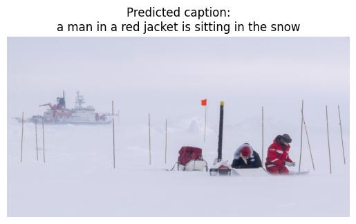
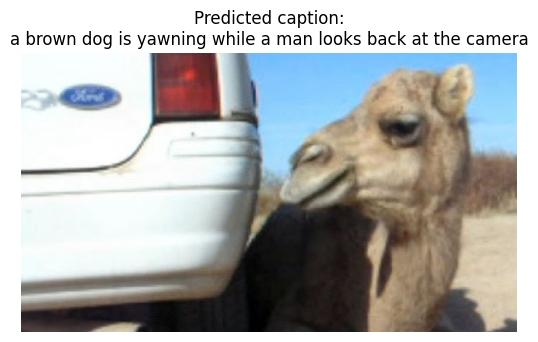
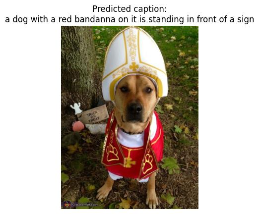
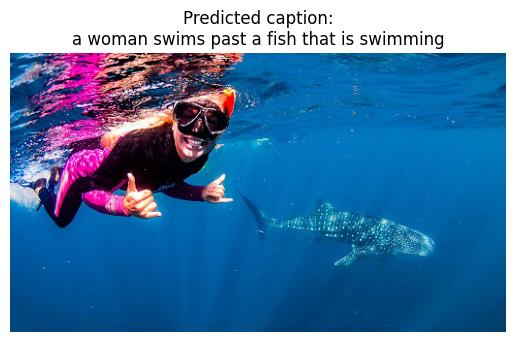

# Multimodal Image Captioning with CLIP and Transformer Decoder

In this week's project, the task is to build a **multimodal image captioning model** that generates textual descriptions for images using a Transformer-based encoder-decoder architecture.

- use the **Flickr30k dataset** from Hugging Face, a large collection of images with **five human-written captions per image**. Our goal is to:
- use a **pretrained CLIP vision encoder** (from OpenCLIP)
- train a **Transformer decoder** to generate captions based on the image embeddings
- use modern tokenization (SentencePiece) and decoding (greedy inference)

This pipeline is inspired by the **"Attention is All You Need"** architecture.

---

## Week 4 - Task Summary

**Step 1 — Data Preparation**

- stream and process images + captions from Flickr30k.
- for each image:
  - convert to patches via CLIP encoder
  - tokenize all 5 captions using SentencePiece
  - create pairs of:
    - `caption_input`: `<sos> + tokens`
    - `caption_label`: `tokens + <eos>`
- cave as `(image, caption_input, caption_label)` triplets

**Step 2 — Model Architecture**

- use a **frozen CLIP vision encoder**
- implement a **Transformer decoder** with:
  - masked self-attention
  - cross-attention over image embeddings
  - Feedforward + residual + LayerNorm

**Step 3 — Training**

- compute cross-entropy loss for next-token prediction
- log metrics using Weights & Biases (`wandb`)
- save model checkpoint after training on the full dataset
  - I am getting the best results on 20k images and 8 epochs, too much time to train for more epochs

**Step 4 — Inference & Evaluation**

- use greedy decoding to generate captions from raw images
- visualize predictions to verify output quality

---

## Example Outputs

Here are a few sample outputs generated using the trained model (I am getting the best results on 20k images and 8 epochs):

| Image                                                       | Predicted Caption                                                |
| ----------------------------------------------------------- | ---------------------------------------------------------------- |
|  | a young boy wearing a blue hat is eating a frozen ice cream cone |
|  | a man in a red jacket is sitting in the snow                     |
|  | a brown dog is yawning while a man looks back at the camera      |
|  | a dog with a red bandanna on it is standing infront of a sign    |
|  | a woman swims past a fish that is swimming                       |

---

## Project Files

### `flickr_dataset.py`

- global setup for loading the Flickr30k dataset from Hugging Face
- class FlickrDebugDataset - fully loads sample_size examples into memory
  - used for testing and understanding the data
- class FlickrStreamDataset - streams image-caption pairs without loading all data in memory
  - used during model training
  - applies image transforms and tokenization on-the-fly
- class FlickrImageOnly
  - used to generate CLIP image embeddings - in s01_image_embeddings.py to compute embeddings
  - gets preprocessed image tensors only (no captions)

### `local_image_embeddings.py`

- load pretrained CLIP model from OpenCLIP (vision + text encoder)
- encode images using `CLIPVisionTransformer`
- store visual embeddings locally for reuse
  - need to change the s01_training script to use them! currently computing embeddings on the go
- optional: encode captions using `CLIPTextTransformer` for semantic comparison/analysis

### `decoder_transformer.py`

- defines a Transformer decoder block with:
  - masked self-attention
  - cross-attention to image embeddings
  - Feedforward and normalization layers

### `caption_model.py`

- combines the CLIP encoder and custom Transformer decoder
- returns logits for next-token prediction over the vocabulary

### `s01_training.py`

- loads training triples and trains the model
- logs progress with `wandb`
- saves the model checkpoint after training

### `evaluate.py`

- evaluates the model using BLEU, METEOR, and CIDEr scores
- loads the checkpoint and generates captions for test embeddings
- visualizes sample predictions

### `s02_inference.py`

- loads the model checkpoint and takes a raw image as input
- encodes image and runs greedy decoding
- visualizes and saves the image + predicted caption

---

## Resources

- [Flickr30k Dataset on HuggingFace](https://huggingface.co/datasets/nlphuji/flickr30k)
- [CLIP: Contrastive Language–Image Pretraining](https://openai.com/research/clip)
- [Attention is All You Need (Vaswani et al., 2017)](https://arxiv.org/abs/1706.03762)
