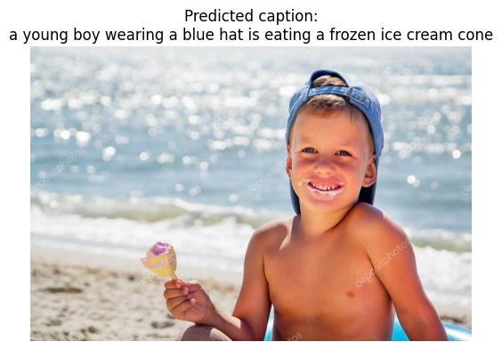

## Image Captioning with CLIP Encoder and Custom Decoder

**Project Objective:**
Generate natural language descriptions for images from the Flickr30k dataset using a pretrained CLIP encoder and a Transformer decoder.

---

### Files (in order of creation):

**`flickr_dataset.py`**
_Internal functionality:_

- global setup for loading the Flickr30k dataset from Hugging Face
- class FlickrDebugDataset - fully loads sample_size examples into memory
  - used for testing and understanding the data
- class FlickrStreamDataset - streams image-caption pairs without loading all data in memory
  - used during model training
  - applies image transforms and tokenization on-the-fly
- class FlickrImageOnly
  - used to generate CLIP image embeddings - in s01_image_embeddings.py to compute embeddings
  - gets preprocessed image tensors only (no captions)

---

**`s01_image_embeddings.py`**
_Internal functionality:_

- load pretrained CLIP model from OpenCLIP (vision + text encoder)
- encode images using `CLIPVisionTransformer`
- store visual embeddings for reuse
- optional: encode captions using `CLIPTextTransformer` for semantic comparison/analysis

---

**`decoder_transformer.py`**
_Internal functionality:_

- define Transformer decoder block:

  - masked self-attention over token inputs
  - cross-attention over image embeddings
  - feed-forward network + residuals + LayerNorm

- input: caption token sequence `[<sos>, ..., ]`
- output: logits over vocabulary

---

**`caption_model.py`**
_Internal functionality:_

- combine pretrained CLIP encoder with custom Transformer decoder
- forward pass:

  - input image → CLIP vision encoder → visual embeddings
  - input caption → decoder → predicted caption logits

- return: sequence logits for training

---

**`s02_training.py`**
_Internal functionality:_

- load preprocessed dataset triples
- initialize decoder model (CLIP encoder frozen)
- compute cross-entropy loss between predicted and true caption tokens
- log training metrics using `wandb`
- save model checkpoint after training

---

**`evaluate.py`**
_Internal functionality:_

- load trained model checkpoint
- evaluate accuracy of predicted captions against ground-truth
- log BLEU/METEOR/CIDEr scores
- visualize sample predictions for sanity checks

---

**`s03_inference.py`**
_Internal functionality:_

- load trained model
- take raw image input
- encode via frozen CLIP encoder
- generate caption via greedy decoding loop starting from `<sos>`
- visualize image + generated caption

---

**Example Output:**

